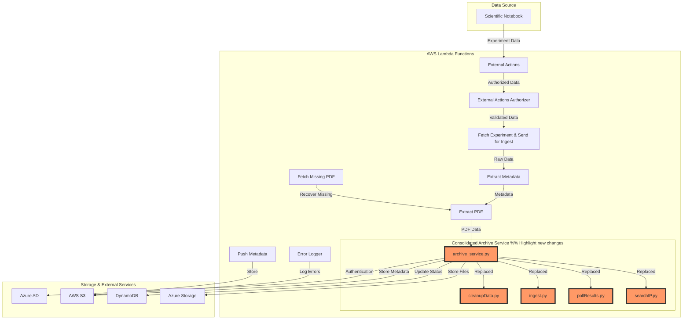

# ELSA System Architecture
 
## System Flow Diagram
 

 
## Architecture Overview
 
1. **Data Ingestion Layer**
   - Scientific Notebook (SNB) serves as the primary data source
   - External Actions handle initial data reception and authorization
   - Fetch Experiment service prepares data for processing
 
2. **Processing Layer**
   - Extract Metadata service processes experiment metadata
   - Extract PDF service handles document extraction
   - Fetch Missing PDF service provides recovery capabilities
 
3. **Archive Layer (New Consolidated Service)**
   - `archive_service.py` now handles multiple functions previously split across:
     * Data ingestion (formerly ingest.py)
     * Status monitoring (formerly pollResults.py)
     * IP search functionality (formerly searchIP.py)
     * Cleanup operations (formerly cleanupData.py)
   - Integrates directly with Azure Storage for file archival
   - Manages authentication through Azure AD
   - Updates status in DynamoDB
 
4. **Storage Layer**
   - AWS S3 for metadata and error logs
   - Azure Storage for archived files
   - DynamoDB for status tracking
 
5. **Monitoring & Error Handling**
   - Error Logger tracks issues across all services
   - Push Metadata service ensures data consistency
   - Status monitoring integrated into archive service
 
The new architecture simplifies the workflow by consolidating multiple services into a single archive service, reducing complexity and improving maintainability while maintaining all necessary functionality.
